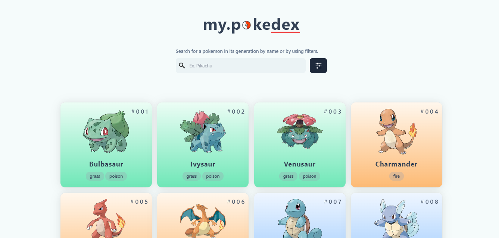

<h1 align="center">
  <a href="https://github.com/Rr-sobusy/pokedex-v2.git">
 Pokedex built using Nextjs and pokeapi.co 
  </a>
   
</h1>

**my.pokedex** is a practice project that created to enhance my coding skills using Nextjs on top of reactjs - an UI building library. 

## Live Demo
Take a look the live demo here 👉 [https://pokedex-v2-chi.vercel.app](https://pokedex-v2-chi.vercel.app)